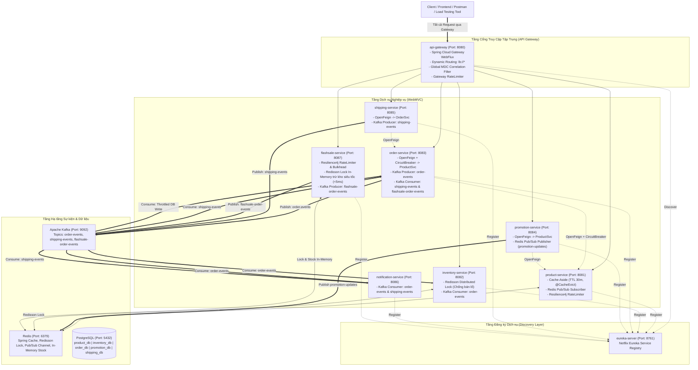

# Online Shopping Event-Driven Microservices Platform

Hệ thống thương mại điện tử **Online Shopping Services** được xây dựng theo kiến trúc **Event-Driven Enterprise Microservices** và chuẩn mực **WebMVC**, tích hợp **Spring Cloud Gateway (8080)**, **Netflix Eureka Server (8761)**, **OpenFeign**, **Resilience4j (CircuitBreaker & RateLimiter)**, **Apache Kafka (Kraft)**, **Redis Cache (Cache-Aside)**, **Redisson Distributed Lock**, **Redis Pub/Sub** và cơ chế xử lý **Flash Sale High-Throughput**.

---

## 1. Sơ đồ Kiến trúc Tổng thể (Overall Architecture)

---

## 2. Ma trận Dịch vụ (Service Matrix)

| Dịch vụ | Cổng | Cơ sở dữ liệu | Eureka ID | Giao tiếp Đồng bộ (Sync) | Giao tiếp Bất đồng bộ (Async) & Cache |
| :--- | :---: | :---: | :---: | :--- | :--- |
| **`eureka-server`** | `8761` | Không | `EUREKA-SERVER` | Service Registry & Discovery | - |
| **`api-gateway`** | `8080` | Không | `API-GATEWAY` | Reverse Proxy, Dynamic Routing `lb://*` | MDC Filter, Gateway Rate Limiting |
| **`product-service`** | `8081` | `product_db` | `PRODUCT-SERVICE` | Resilience4j RateLimiter | Redis Cache (TTL 30m), Sub: `promotion-updates` |
| **`inventory-service`** | `8082` | `inventory_db` | `INVENTORY-SERVICE` | Resilience4j CircuitBreaker | Sub: `order-events`, Redisson Lock (`lock:product:{id}`) |
| **`order-service`** | `8083` | `order_db` | `ORDER-SERVICE` | OpenFeign -> `PRODUCT-SERVICE` (CircuitBreaker) | Pub: `order-events`, Sub: `shipping-events`, `flashsale-order-events` |
| **`promotion-service`** | `8084` | `promotion_db` | `PROMOTION-SERVICE` | OpenFeign -> `PRODUCT-SERVICE` | Pub: Redis channel `promotion-updates` |
| **`shipping-service`** | `8085` | `shipping_db` | `SHIPPING-SERVICE` | OpenFeign -> `ORDER-SERVICE` | Pub: Kafka topic `shipping-events` |
| **`notification-service`** | `8086` | - | `NOTIFICATION-SERVICE` | - | Sub: Kafka topics `order-events`, `shipping-events` |
| **`flashsale-service`** | `8087` | Redis | `FLASHSALE-SERVICE` | Resilience4j RateLimiter | Redisson Lock In-Memory, Pub: `flashsale-order-events` |

---

## 3. Lộ trình Triển khai 6 Feature Branches

Mỗi bài tập trong `.agents/plan` được phát triển trên một Feature Branch riêng biệt:

1. **`feature/exercise-01-product-redis-cache`** (exercise01.md):
   - Xây dựng `eureka-server` (8761), `api-gateway` (8080) và `product-service` (8081).
   - Triển khai Redis Cache-aside (TTL 30 phút, `@CacheEvict`), Resilience4j RateLimiter cho endpoint xem sản phẩm.
2. **`feature/exercise-02-order-kafka-async`** (exercise02.md):
   - Xây dựng `order-service` (8083), `inventory-service` (8082), `notification-service` (8086).
   - Tích hợp OpenFeign + CircuitBreaker gọi sang `product-service`.
   - Kafka Producer/Consumers cho topic `order-events` (trừ kho và gửi mail bất đồng bộ).
3. **`feature/exercise-03-inventory-distributed-lock`** (exercise03.md):
   - Triển khai **Redisson Distributed Lock** (`lock:product:{id}`) trong `inventory-service`.
   - Chống bán lố (overselling) khi 100 luồng đồng thời tranh chấp trừ kho.
4. **`feature/exercise-04-promotion-redis-pubsub`** (exercise04.md):
   - Xây dựng `promotion-service` (8084) với OpenFeign.
   - Redis Pub/Sub trên channel `promotion-updates` xóa cache sản phẩm tức thì trong `product-service` (<1s).
5. **`feature/exercise-05-shipping-order-choreography`** (exercise05.md):
   - Xây dựng `shipping-service` (8085).
   - Kafka topic `shipping-events`: Chuyển trạng thái đơn hàng sang `COMPLETED` trong `order-service` và gửi thông báo trong `notification-service`.
6. **`feature/exercise-06-flashsale-immortal-engine`** (exercise06.md):
   - Xây dựng `flashsale-service` (8087) với Resilience4j RateLimiter.
   - Preload tồn kho lên Redis, Redisson Lock trừ kho In-Memory siêu tốc (<5ms), bắn `flashsale-order-events` sang Kafka để `order-service` ghi DB PostgreSQL thong thả.
