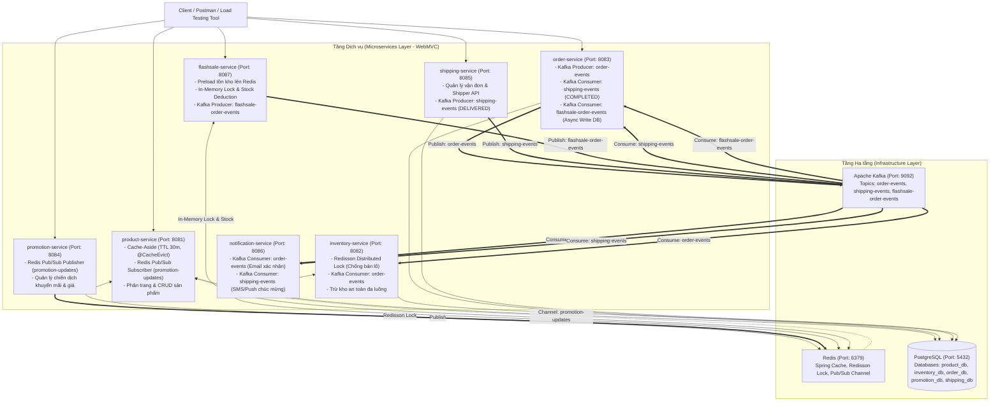

# Online Shopping Event-Driven Microservices Platform

Hệ thống thương mại điện tử **Online Shopping Services** được xây dựng theo kiến trúc **Event-Driven Microservices** và chuẩn mực **WebMVC**, kết hợp **Apache Kafka (Kraft)**, **Redis Cache (Cache-Aside)**, **Redisson Distributed Lock**, **Redis Pub/Sub** và cơ chế xử lý **Flash Sale High-Throughput**.

---

## 1. Sơ đồ Kiến trúc Tổng thể (Overall Architecture)

---

## 2. Ma trận Dịch vụ (Service Matrix)

| Dịch vụ | Cổng | Cơ sở dữ liệu | Bài tập | Trách nhiệm chính |
| :--- | :---: | :---: | :---: | :--- |
| **`product-service`** | `8081` | `product_db` | **Bài 1, Bài 4** | Quản lý sản phẩm, Cache-Aside Redis (TTL 30 phút), `@CacheEvict`, Redis Pub/Sub Subscriber làm mới giá tức thì |
| **`inventory-service`** | `8082` | `inventory_db` | **Bài 2, Bài 3** | Quản lý tồn kho, Redisson Distributed Lock chống bán lố, Kafka Consumer `order-events` tự động trừ kho |
| **`order-service`** | `8083` | `order_db` | **Bài 2, Bài 5, Bài 6** | Quản lý vòng đời đơn hàng, Producer `order-events`, Consumer `shipping-events` (chuyển sang `COMPLETED`), Consumer `flashsale-order-events` lưu DB thong thả |
| **`promotion-service`** | `8084` | `promotion_db` | **Bài 4** | Quản lý chương trình khuyến mãi, Redis Pub/Sub Publisher bắn event `promotion-updates` |
| **`shipping-service`** | `8085` | `shipping_db` | **Bài 5** | Quản lý vận chuyển, Producer `shipping-events` khi shipper giao hàng thành công |
| **`notification-service`** | `8086` | - | **Bài 2, Bài 5** | Gửi email xác nhận đặt hàng và SMS/Push chúc mừng nhận hàng thành công |
| **`flashsale-service`** | `8087` | Redis (In-memory) | **Bài 6** | Warm-up tồn kho Redis, Redisson Lock trừ kho In-Memory cực nhanh (<5ms), Producer `flashsale-order-events` |

---

## 3. Quy chuẩn Kỹ thuật

- **Kiến trúc:** WebMVC chuẩn mực (`controller`, `service`, `repository`, `entity`, `dto`, `exception`, `config`).
- **Distributed Tracing:** MDC Logging kèm `correlationId` xuyên suốt từ HTTP Header `X-Correlation-Id` sang Kafka Header và Redis Messages.
- **Validation & Exception Handling:** `@Valid`, `@RestControllerAdvice` trả về chuẩn `ApiResponse<T>`.
- **Phân trang:** Mọi API danh sách đều hỗ trợ `Pageable` và trả về `PageResponse<T>`.
